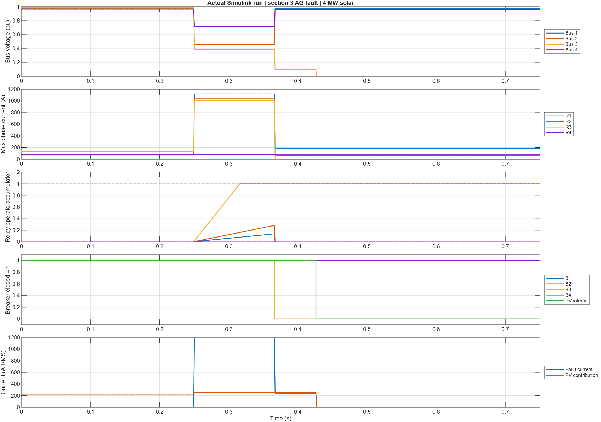
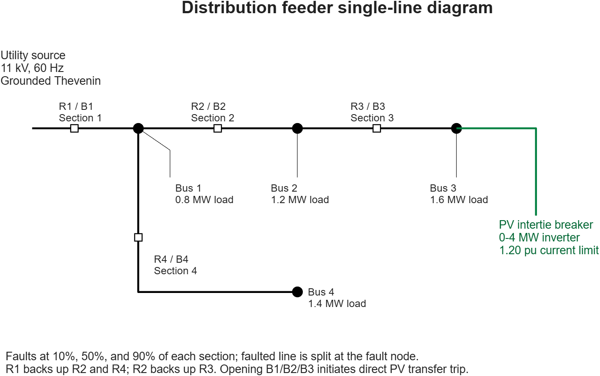
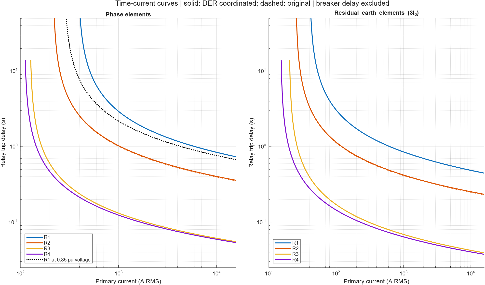
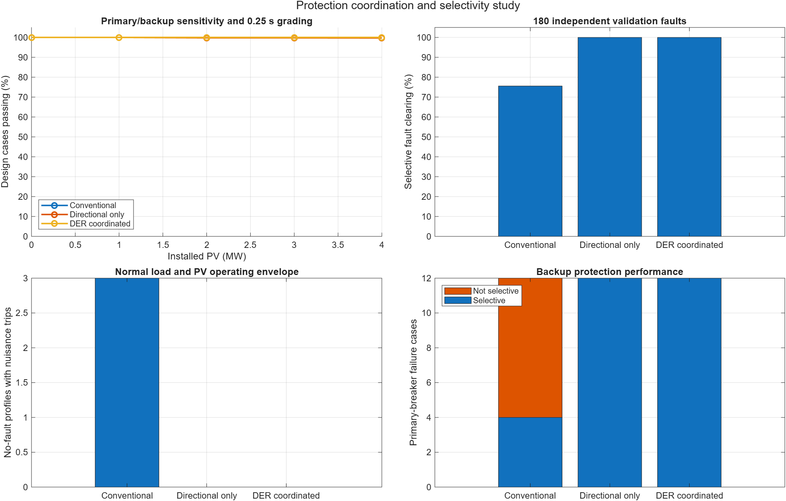
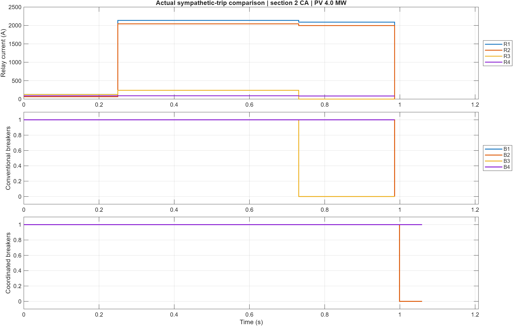
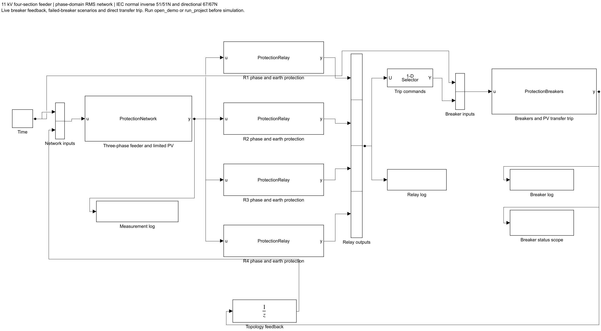
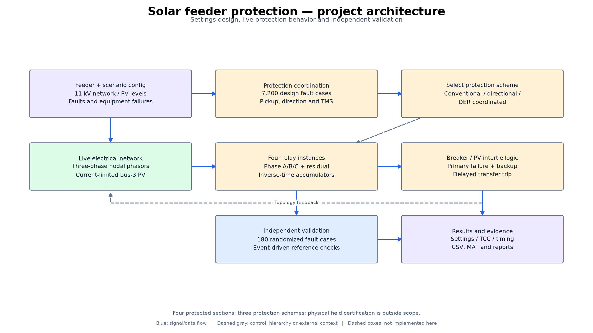

# Protection Coordination with Distributed Solar

A complete MATLAB/Simulink engineering study of an **11 kV radial feeder with four protected sections and 0–4 MW of solar generation**. It compares conventional overcurrent protection, directional protection, and DER-coordinated protection with source voltage restraint.



## What this project demonstrates

- Three-phase fault calculations with positive-, negative-, and zero-sequence line/source impedances.
- IEC normal-inverse phase and residual-earth relay elements, CT scaling, directional supervision, and time grading.
- Current-limited solar fault contribution, reverse export, and sympathetic tripping.
- Stateful breaker operation, primary-breaker failure, backup protection, and direct PV transfer trip.
- A reproducible design sweep, independent validation, exported curves, raw results, and numerical verification.

This project uses an explicit **RMS/phasor nodal electrical model inside Simulink**, with MATLAB System blocks and live breaker feedback. It is not a switching-inverter, waveform-based EMT, or native Simscape component model. It needs **MATLAB and Simulink**, without additional toolboxes. Tested in MATLAB R2025b on Windows.

## Run it

Download the entire repository, extract it, and open this folder in MATLAB.

```matlab
run_project                  % Reproduce settings, study, model, figures and report
open_demo                    % Open the saved coordinated protection model
```

Click **Run** in Simulink. The model logs `measurements`, `relayLog`, and `breakerLog` in its simulation output. Double-click the breaker Scope to see breaker/intertie status.

The included data and model allow the demo to run without repeating the full study:

```matlab
open_demo('conventional',4,'ABC',4)   % Compare the original protection
open_demo('directional',4,'ABC',4)    % Add direction supervision only
open_demo('coordinated',3,'AG',4,3)   % B3 fails; R2 provides backup
open_demo('coordinated',3,'AG',0)     % No solar contribution
```

Arguments are scheme, faulted section, fault type, installed PV MW, and failed breaker ID. Supported faults: AG, BG, CG, AB, BC, CA, ABG, BCG, CAG, ABC. **ABC means a balanced three-phase-to-ground fault in this project.** A vector of failed breakers can test multiple failures.

For other fault resistance, location, loading or source strength, configure the workspace scenario after calling `open_demo`:

```matlab
studyScenario = evalin('base','studyScenario');
studyScenario.Rf = 10;
studyScenario.location = 0.9;
assignin('base','studyScenario',studyScenario);
set_param('solar_feeder_protection','StopTime','45');
out = sim('solar_feeder_protection');
```

All electrical inputs and timing settings are documented in `src/study_config.m`. The network recalculates whenever a fault, breaker state, or PV intertie state changes. Changing settings requires rerunning the study; the provided tests enforce the default design assumptions.

## Feeder and protection architecture



R1 protects the common feeder and backs up R2/R4. R2 backs up R3. A grounded utility Thevenin source supplies grounded wye fixed-impedance loads. The bus-3 inverter provides positive-sequence active/reactive current with a **1.20 pu phase-current limit** and reactive priority during voltage sag.

Relays have four independent inverse-time accumulators: phases A/B/C and residual current `3I0`. Phase direction uses an ideal nominal memory-voltage reference; ground direction uses zero-sequence voltage polarization. The improved source relay R1 uses an explicitly modeled voltage-restraint characteristic. This is an educational custom implementation, not a manufacturer relay emulation.

Opening B1/B2/B3 initiates a PV intertie transfer trip: **20 ms communication + 40 ms intertie opening**. All feeder breakers have **50 ms operating delay**. The coordination target is at least **250 ms from primary-breaker opening to a prospective backup trip command**.

## Study and results

The design sweep has **7,200 fault cases** spanning four sections, ten fault types, three locations, three resistances, five PV ratings, two source strengths, and two load levels. The independent validation set has **180 newly randomized fault cases**, withheld from setting calculation. Three schemes are evaluated on 570 dynamic scenarios each, including normal operation and deliberately failed equipment/communication cases.

Bundled default-run results:

| Metric | Conventional | Directional only | DER coordinated |
|---|---:|---:|---:|
| Design grading/sensitivity violations | 10 | 10 | 0 |
| Independent selective fault clearing | 136/180 | 180/180 | 180/180 |
| No-fault profiles with nuisance trips | 3/15 | 0/15 | 0/15 |
| Selective primary-breaker backup cases | 4/12 | 12/12 | 12/12 |

The improved scheme's minimum finite primary/backup margin is **253.4 ms**, exceeding the 250 ms target. Direction supervision fixes the tested sympathetic trips; recalculated grading and source voltage restraint resolve the remaining design-envelope timing/sensitivity violations.







Exact results, settings and limitations are in the generated [engineering report](docs/engineering_report.md), [summary CSV](results/summary.csv), and [machine-readable summary](results/summary.json). The PNG/PDF figures are actual exports from the executed study.

A [printable PDF report](docs/engineering_report.pdf) and [standalone HTML report](docs/engineering_report.html) are included. After reproducing the MATLAB study, Windows users can rebuild them by running `docs/build_report.ps1` in PowerShell; the PDF helper uses Microsoft Edge.

The study checks primary/backup sensitivity separately from time grading: an absent required relay is a failure, not an infinitely large successful margin. It also treats fault clearance as the disappearance of current from **all** sources, including solar after feeder breaker opening.

Some high-resistance, near-pickup faults remain slow even with successful grading. This study has no universal maximum fault-duration requirement. See the engineering report before interpreting results as practical protection performance.

## Reproducibility and verification

- Independent Thevenin and sequence-network calculations check balanced and ground-fault currents.
- A numerical checkpoint verifies the inverse-time curve and below-pickup behavior.
- Design cases check KCL residual, inverter current limit, primary sensitivity, and grading.
- Dynamic cases check selectivity, no-fault security, backup operation, and disabled transfer trip.
- A two-breaker-failure case verifies source backup for a sensitive remote fault.
- Every live Simulink measurement is checked against a separate circuit solve; relay/breaker times are compared with an event-driven reference.

The report separates design-envelope results from independent validation. All scenarios, raw tables, MAT files, settings, screenshots, vector PDFs and verification outputs are included. Local build caches and diagnostic logs are excluded.

## Repository guide

| Location | Contents |
|---|---|
| `run_project.m` | Complete reproducible workflow |
| `open_demo.m` | Interactive model setup and scenario selection |
| `models/solar_feeder_protection.slx` | Live closed-loop Simulink model |
| `src/network_solve.m` | Three-phase nodal circuit and inverter commands |
| `src/coordinate_settings.m` | Pickup selection and constrained time grading |
| `src/Protection*.m` | Live network, relay and breaker System blocks |
| `src/simulate_case.m` | Independent event-driven reference |
| `src/verify_project.m` | Electrical, protection and Simulink verification |
| `data/design.mat` | Design cases, settings and unit-time coefficients |
| `data/study.mat` | Full scenario definitions and study results |
| `results/` | Raw CSV/JSON/MAT results, PNG screenshots, PDF plots |
| `docs/engineering_report.md` | Equations, settings, results and limitations |
| `docs/resume_and_interview.md` | Measured resume bullet and interview preparation |



## Technical references

- [MathWorks: overcurrent protection and coordination](https://www.mathworks.com/help/simscape-electrical/ug/relay-overcurrent-protection.html)
- [NREL: protection challenges with inverter-based resources](https://www.nrel.gov/grid/protection.html)
- [NREL: inverter-based DER fault characteristics](https://doi.org/10.2172/971441)

This is a simulation-based portfolio study. Its inverter, measurements, and relay polarization are simplified; it does not establish field performance or standards compliance.

## Architecture diagrams



See the [architecture and implementation gallery](docs/ARCHITECTURE.md) for
the detailed model/control structure and electrical topology
diagrams, source mappings, scope boundaries, editable definitions, and PNG/SVG figures.
