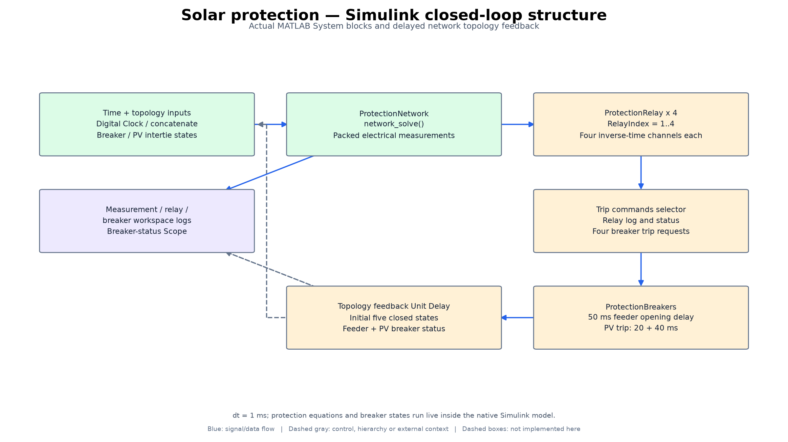
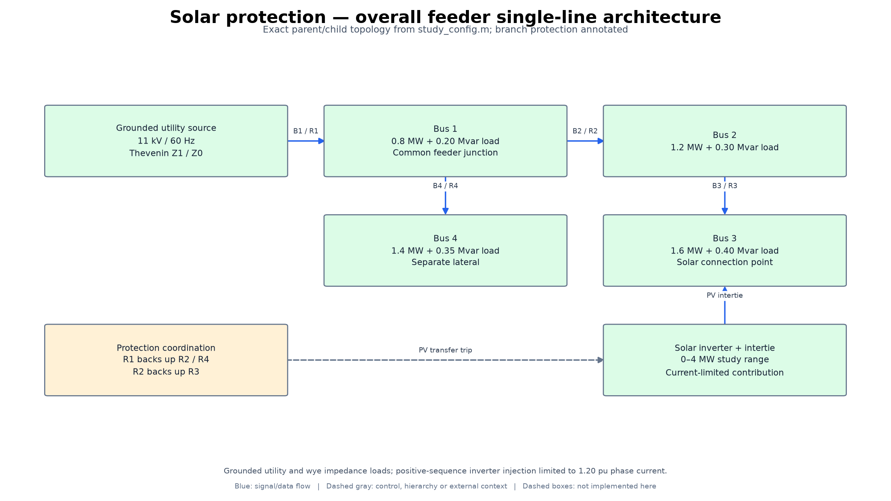

# Architecture and implementation diagrams

11 kV RMS/phasor feeder and custom relay/breaker simulation; no switching-level inverter, physical relay implementation or FPGA RTL.

These diagrams were derived from the source files linked below. They are
annotated engineering block diagrams, not Vivado synthesized-netlist exports,
application screenshots, PCB schematics, or newly validated hardware.

## project architecture

Settings design, live protection behavior and independent validation.

Four protected sections; three protection schemes; physical field certification is outside scope.

[Scalable SVG](diagrams/figures/architecture_overview.svg)

## Simulink closed-loop structure

Actual MATLAB System blocks and delayed network topology feedback.

dt = 1 ms; protection equations and breaker states run live inside the native Simulink model.

[Scalable SVG](diagrams/figures/model_structure.svg)

## overall feeder single-line architecture

Exact parent/child topology from study_config.m; branch protection annotated.

Grounded utility and wye impedance loads; positive-sequence inverter injection limited to 1.20 pu phase current.

[Scalable SVG](diagrams/figures/electrical_topology.svg)

## Source mapping and reproduction

Dashed boxes are external integration context, not delivered implementations.
Blue arrows show data/signal flow; dashed gray arrows show control, hierarchy,
or external context. Internal responsibility boxes may represent functions or
register groups rather than separately instantiated modules.

Electrical-topology arrows show reference connections, not a restriction to
one-way power flow. The diagrams summarize mathematical network elements;
they are not construction-ready electrical schematics.

Source files:

- [src/study_config.m](../src/study_config.m)
- [src/build_protection_model.m](../src/build_protection_model.m)
- [src/ProtectionRelay.m](../src/ProtectionRelay.m)
- [src/network_solve.m](../src/network_solve.m)
- [src/coordinate_settings.m](../src/coordinate_settings.m)
- [src/ProtectionBreakers.m](../src/ProtectionBreakers.m)

Source revision: `b3ec976d06eb4f0c2d7b38c9034dca34712d856a`. The [provenance manifest](diagrams/provenance.json)
records hashes of the inspected source files. No functional source or existing
simulation results were changed for this documentation update.

To regenerate, install `docs/diagrams/requirements.txt` in a separate Python
environment and run `python docs/diagrams/render.py` from the repository root.
The editable block/connection definitions are in [design.json](diagrams/design.json).
